# 🌌 Cosmos

Este projeto foi desenvolvido como parte do teste técnico proposto pelo Daniel da **Always Fit**. A proposta era simples: escolher um tema que eu gostasse, com liberdade total de escopo e design, e construir um app Flutter demonstrando minhas habilidades.

Escolhi o **universo** — algo que sempre me fascinou — e construí o Cosmos: um app que reúne a imagem astronômica do dia (NASA), notícias espaciais, lançamentos de foguetes, um sistema solar interativo, observatórios brasileiros e um quiz pra testar os conhecimentos do usuário.

## 📲 Download

> **[Baixar APK](https://github.com/AndreWar10/cosmos-app/releases/latest)** — instale direto no Android para testar.

## Screenshots

### Android

<table align="center">
  <tr>
    <td align="center">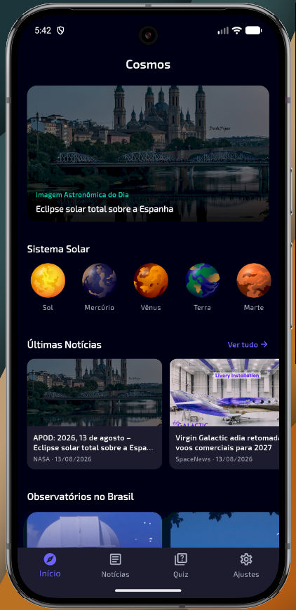</td>
    <td align="center">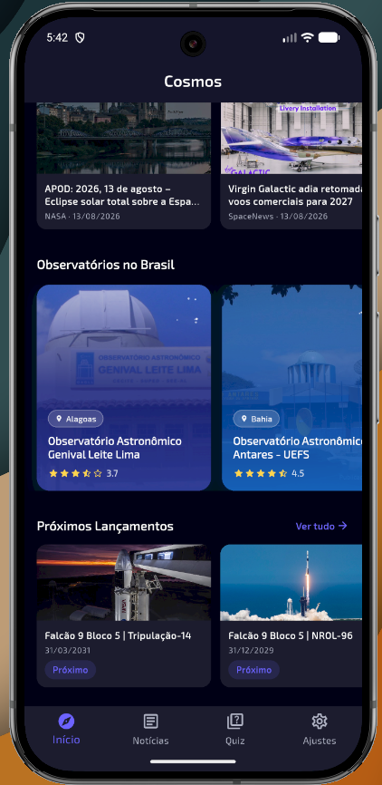</td>
    <td align="center">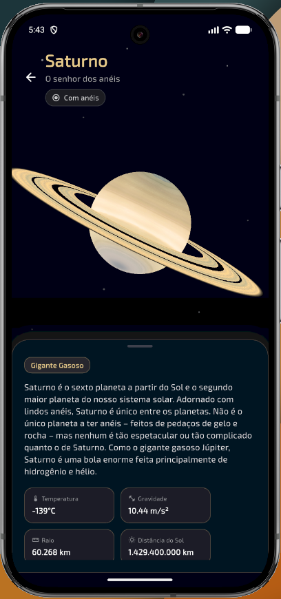</td>
    <td align="center">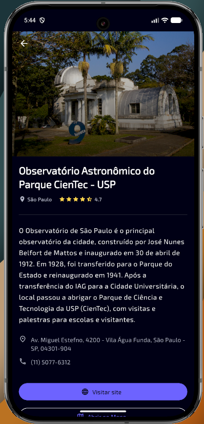</td>
  </tr>
  <tr>
    <td align="center">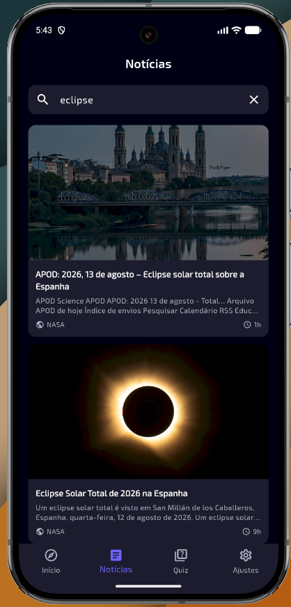</td>
    <td align="center">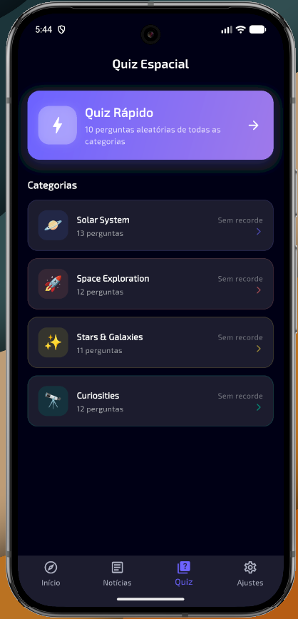</td>
    <td align="center">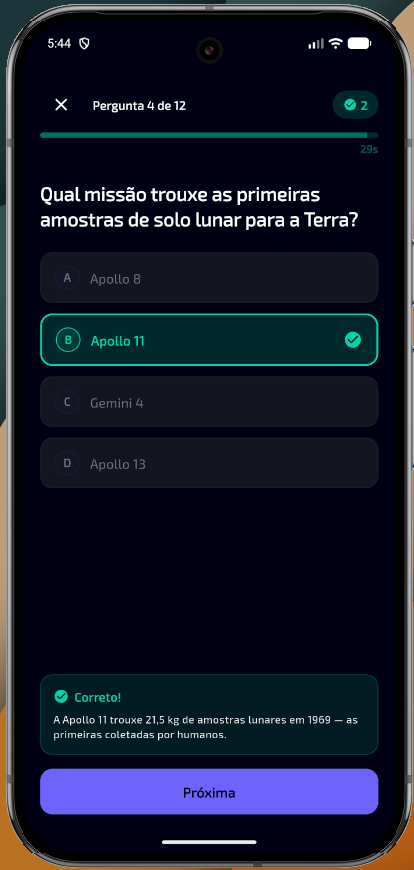</td>
    <td align="center">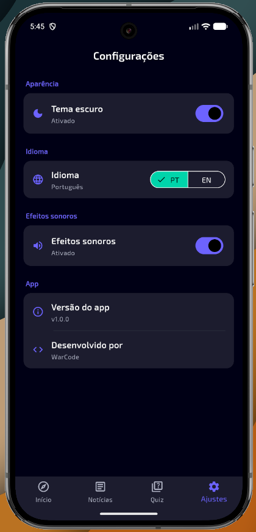</td>
  </tr>
</table>

### iOS

<table align="center">
  <tr>
    <td align="center">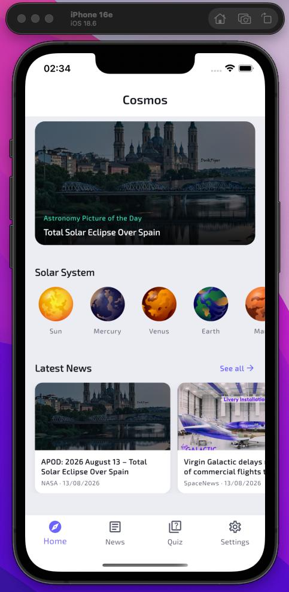</td>
    <td align="center">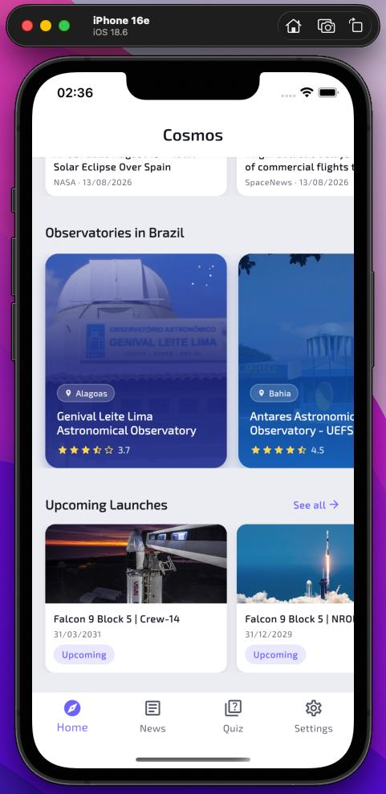</td>
    <td align="center">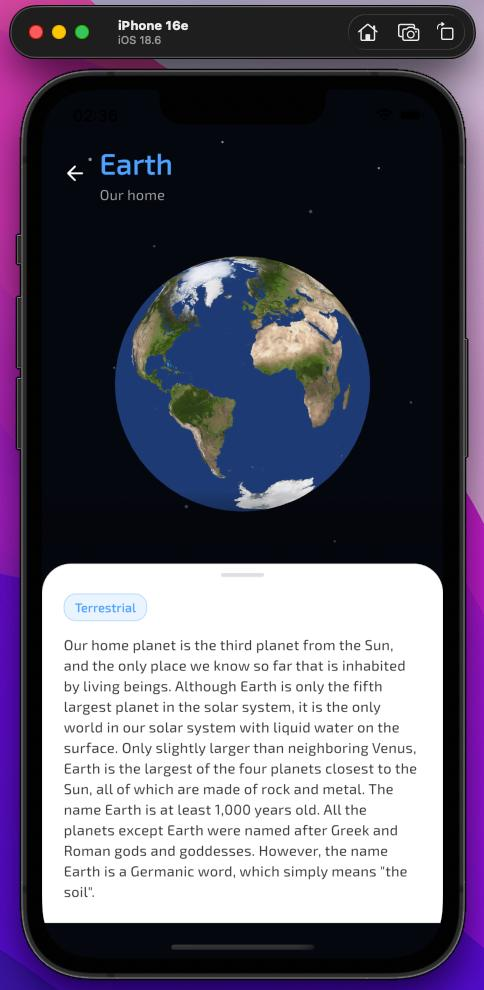</td>
    <td align="center">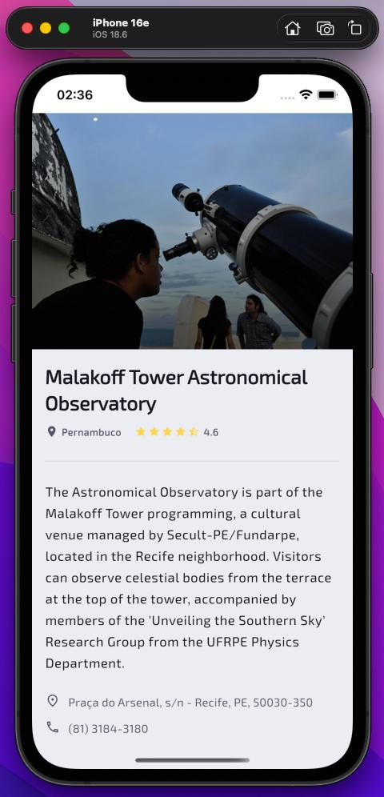</td>
  </tr>
  <tr>
    <td align="center">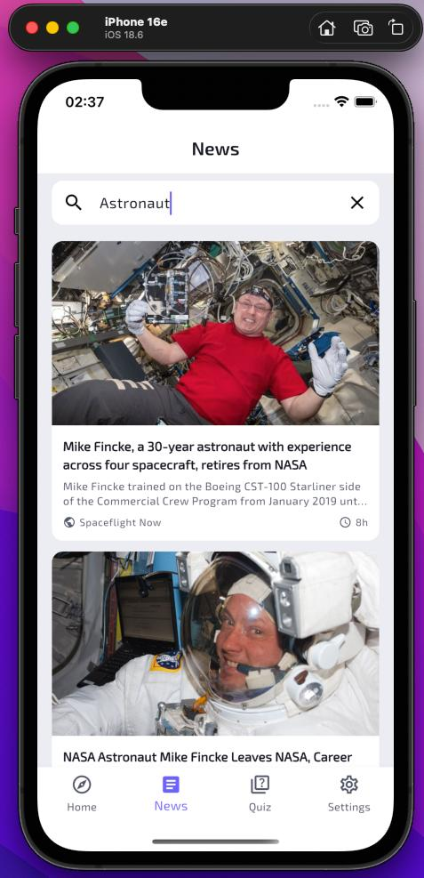</td>
    <td align="center">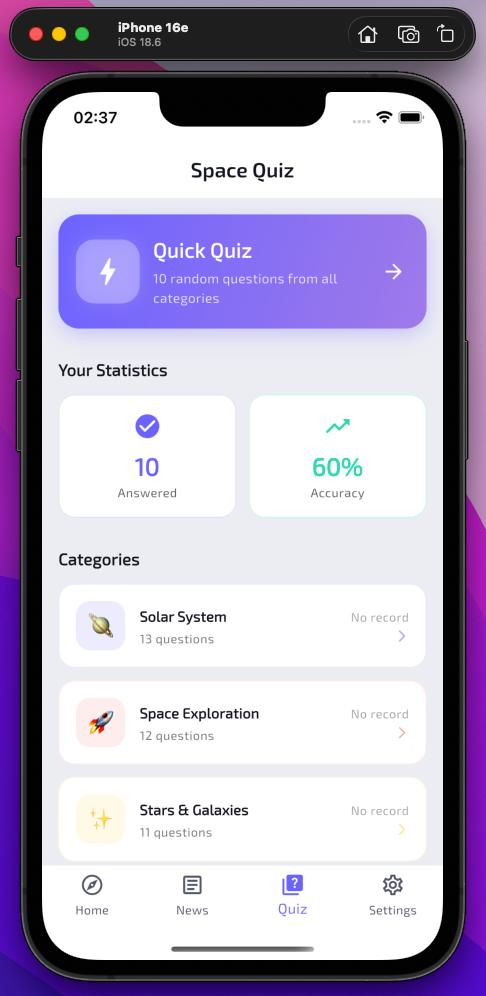</td>
    <td align="center">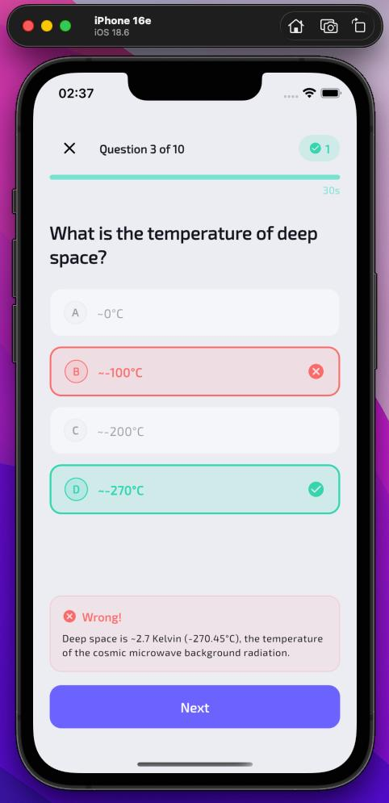</td>
    <td align="center">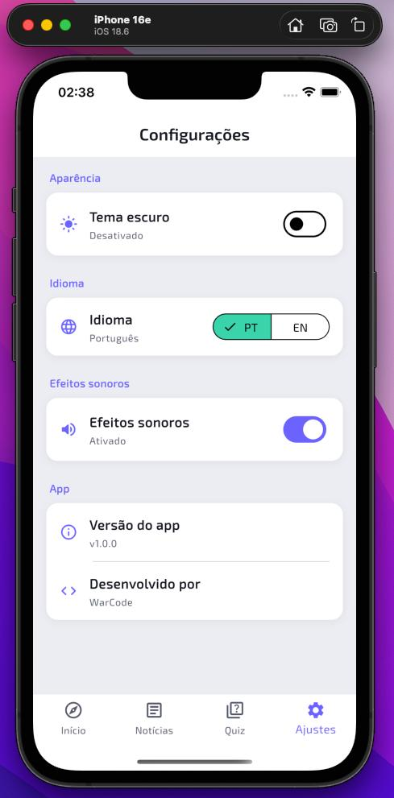</td>
  </tr>
</table>

## Como foi o desenvolvimento

As APIs públicas que consomem dados da NASA, Spaceflight News e Launch Library são todas em inglês. Como o app precisava funcionar em português e inglês, criei um **[backend próprio](https://github.com/AndreWar10/cosmos-back)** que serve como proxy: ele agrega os dados dessas fontes, traduz os conteúdos e expõe endpoints prontos pro app consumir.

Alguns dados não precisam de API — informações do sistema solar, observatórios brasileiros e as perguntas do quiz são carregados localmente via JSON para melhor performance.

### O que o app tem

- **Home** — foto astronômica do dia, sistema solar com planetas interativos, carrosséis de notícias, observatórios e lançamentos
- **Notícias** — feed com busca e scroll infinito, cada notícia abre detalhe com webview pro artigo completo
- **Quiz** — 4 categorias, ~50 perguntas em PT/EN, timer de 30s, efeitos sonoros e hápticos, ranking salvo por categoria
- **Configurações** — tema dark/light, idioma (PT/EN) e toggle de sons, tudo persistido
- **Detalhes** — cada planeta tem dados orbitais e modelo 3D; lançamentos mostram patch, status e links; observatórios têm avaliação e acesso ao site/mapa

### Cenários previstos

- **Sem internet**: todas as telas exibem feedback amigável com botão de retry
- **Fallback de APOD**: se a foto do dia ainda não estiver disponível, carrega a do dia anterior
- **Orientação**: bloqueada em portrait

## Arquitetura

O projeto segue **Clean Architecture** organizado por feature. Cada feature tem três camadas separadas: `domain` (entidades, contratos e use cases — Dart puro), `data` (implementações, models e data sources) e `presentation` (pages, widgets e BLoCs/Cubits).

O `core/` contém abstrações compartilhadas — wrappers de rede (Dio com interceptors), cache (SharedPreferences), injeção de dependência (GetIt), tema, rotas e widgets reutilizáveis.

```
lib/
├── core/                  # Rede, cache, DI, tema, rotas, widgets compartilhados
├── features/
│   ├── home/              # Home (APOD, sistema solar, carrosséis)
│   ├── news/              # Notícias espaciais
│   ├── launches/          # Lançamentos de foguetes
│   ├── quiz/              # Quiz espacial
│   ├── settings/          # Configurações (tema, idioma, sons)
│   ├── apod/              # Detalhe da foto astronômica com navegação por data
│   ├── solar_system/      # Detalhe dos planetas (3D + dados orbitais)
│   └── observatories/     # Observatórios brasileiros
├── i18n/                  # Internacionalização (ARB + gerados)
└── main.dart
```

### Padrões e decisões

- **BLoC/Cubit** pra gerenciamento de estado — cada feature com seu próprio
- **GetIt** como service locator — registro de dependências por feature
- **Dio** com interceptor de locale que prefixa `/pt/` nas chamadas quando o idioma é português
- **Extensions** pra acesso limpo a traduções (`context.translate`)
- **Abstrações** nos data sources — contratos no domain, implementações no data
- Widgets extraídos das pages para a pasta `widgets/` de cada feature

## Internacionalização

O app funciona em **Português** e **Inglês**. O idioma padrão é o do sistema do usuário (se suportado), senão inglês. Pode ser trocado nas configurações e a escolha fica salva.

Usa o sistema oficial do Flutter com arquivos ARB em `lib/i18n/` e a classe gerada `AppLocalizations`.

## Stack

| | |
|---|---|
| Framework | Flutter 3.44.6 · Dart 3.12.2 |
| Estado | `flutter_bloc` (BLoC / Cubit) |
| DI | `get_it` |
| HTTP | `dio` |
| Cache | `shared_preferences` |
| Imagens | `cached_network_image` |
| 3D | `flutter_cube` |
| WebView | `webview_flutter` |
| Áudio | `audioplayers` |
| Env | `flutter_dotenv` |
| i18n | ARB + `flutter gen-l10n` |
| Testes | `flutter_test` · `bloc_test` · `mocktail` |

## Testes

O projeto tem **167 testes** cobrindo todas as camadas da arquitetura:

| Camada | Coverage |
|---|---|
| Domain (entities, use cases) | **95–100%** |
| Data (models, data sources, repositories) | **80–100%** |
| BLoCs / Cubits | **81–100%** |
| Presentation (pages, widgets) | **65–100%** |
| Core (navegação, tema, locale) | **88–100%** |

> O coverage geral de linha inclui widgets de UI puro, código gerado (i18n) e infraestrutura (DI, rotas, env) que não possuem lógica testável por natureza. A camada de **lógica de negócio** (domain + data + blocs) tem cobertura de **90%+**.

```bash
# Rodar testes
flutter test

# Gerar relatório de coverage em HTML
flutter test --coverage
dart pub global run coverde report -i coverage/lcov.info
```

## Como rodar

```bash
git clone https://github.com/AndreWar10/cosmos-app.git
cd cosmos-app

# Criar .env na raiz
echo "BASE_URL=https://cosmos-back.onrender.com" > .env

# Instalar dependências e gerar i18n
flutter pub get
flutter gen-l10n

# Rodar
flutter run
```

## API

O app consome a **[Cosmos API](https://github.com/AndreWar10/cosmos-back)** — backend Node.js que agrega NASA, Spaceflight News e Launch Library 2, com tradução automática.

| Endpoint | Descrição |
|---|---|
| `GET /api/apod` | Foto astronômica do dia (suporta `?date=`) |
| `GET /api/news` | Notícias espaciais (paginadas) |
| `GET /api/launches` | Lançamentos (paginados, filtráveis por status e upcoming) |

---

Desenvolvido por **André Guerra (WarCode)** com auxílio do Cursor AI.
